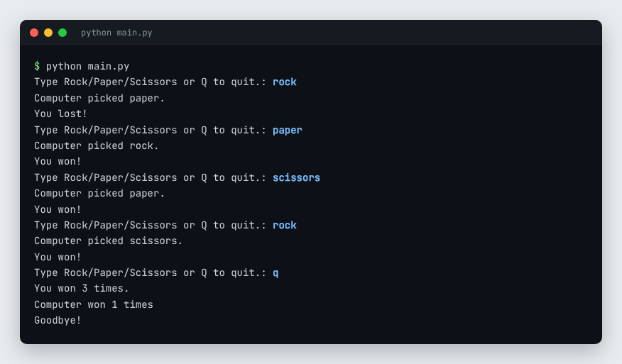

# Rock Paper Scissors

A classic Rock Paper Scissors game implemented in Python with a command-line interface.

<p align="center"></p>
<p align="center"><sub>Four rounds against the computer, then Q to quit</sub></p>

## 📋 Overview

A simple and fun implementation of the classic Rock Paper Scissors game where you can play against the computer.

## 🎮 Features

- **Play vs Computer** – Challenge the AI
- **Multiple Rounds** – Play best of series
- **Score Tracking** – Keep score throughout game
- **Easy to Play** – Simple command-line interface
- **Random AI** – Unpredictable computer moves
- **Game Statistics** – Win/loss/tie breakdown

## 🛠️ Technologies Used

- **Python 3** – Language
- **Random Module** – Computer AI
- **Standard Library** – No external dependencies

## 🚀 Getting Started

### Prerequisites
- Python 3.x installed

### Installation

```bash
# Clone the repository
git clone https://github.com/Scarface96/rock-paper-scissors.git
cd rock-paper-scissors
```

### Running the Game

```bash
python rock_paper_scissors.py
```

Or:
```bash
python3 rock_paper_scissors.py
```

## 📖 How to Play

1. **Run the Game** – Execute the Python script
2. **Choose Your Move** – Enter 'rock', 'paper', or 'scissors'
3. **See Result** – Compare with computer's move
4. **Play Again** – Continue or quit
5. **Check Score** – View overall statistics

## 🎯 Rules

- **Rock** beats Scissors
- **Scissors** beats Paper
- **Paper** beats Rock
- Same choices result in a tie

## 📊 Game Modes

### Single Game
- Play one round
- Immediate result

### Best of Series
- Play multiple rounds
- Track cumulative score

### Continuous Play
- Play indefinitely
- View running statistics

## 💾 Features

- Win tracking
- Loss tracking
- Tie tracking
- Win percentage calculation
- Game history (optional)

## 🔧 Customization

Edit the code to:
- Adjust difficulty
- Add new game modes
- Create variations
- Enhance UI

## 📝 License

This project is open source and available under the MIT License.

---

Built with ❤️ by [Scarface96](https://github.com/Scarface96)